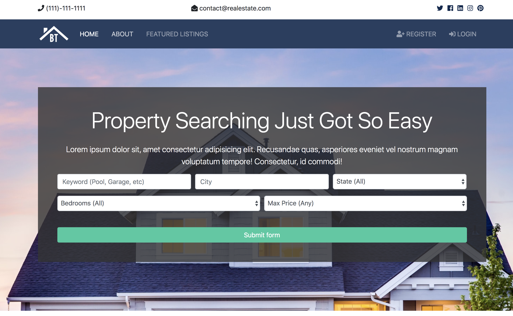
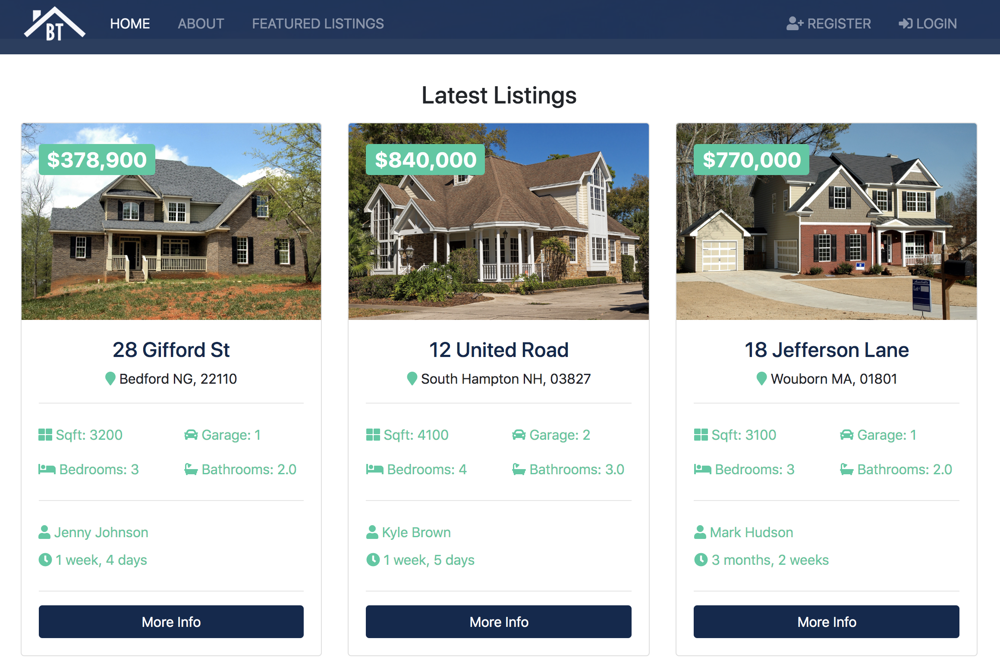
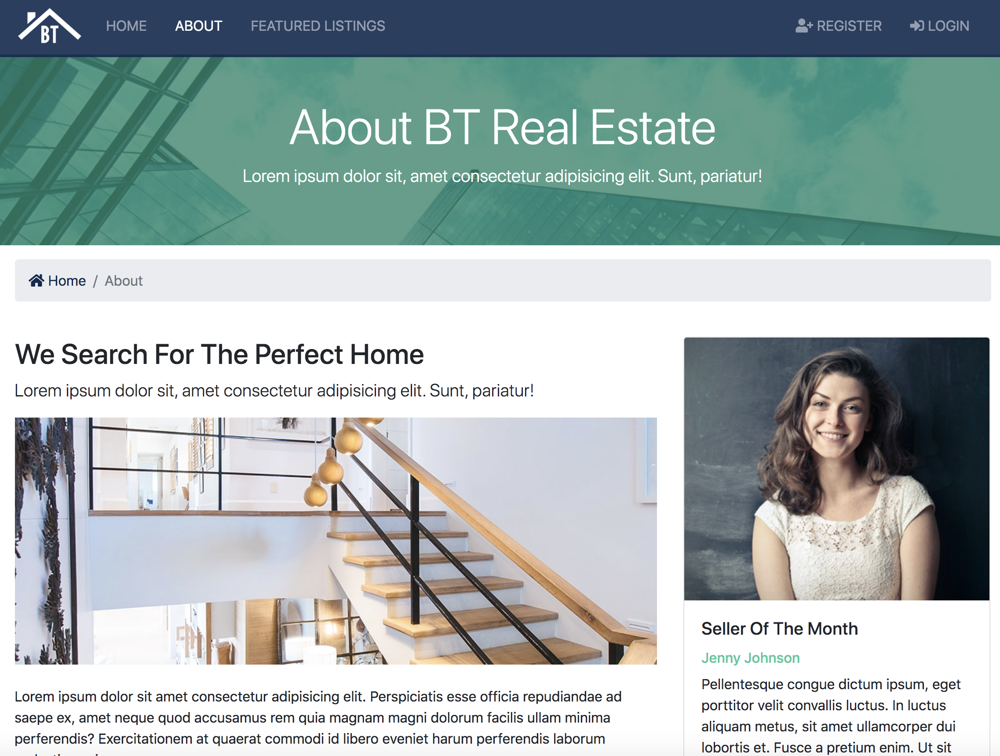
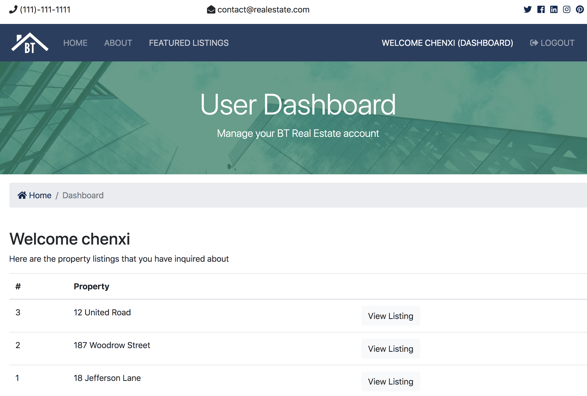

## Real Estate Website Project

> 一个基于Python3.6.5 + Django 2.1.1 制作的“房地产”网站项目

[Real Estate]: (http://real-estate.chenxii.xyz)

**Preview | 预览**













------

### 技术栈

- Django：2.1.1
- Python：3.6.5
- Pillow：6.2.1
- psycopg2：2.8.4
- psycopg2-binary：2.8.4
- pytz：2019.3


------

### 本地运行

1. 创建文件夹、克隆项目到该文件夹 | Create file and git clone this project to local file

   ```
   mkdir django_learn
   cd django_learn
   git clone https://github.com/ChenxiiCheng/Django-Real-Estate.git
   ```

2. 创建并激活虚拟环境 | Create and activate virtual environment

   ```
   python3 -m venv ./venv
   
   #linux or mac
   source ./venv/bin/activate
   ```

3. 安装项目依赖 | Pip install packages

   ```
   pip install -r requirements.txt
   ```

4. 迁移数据库 | Migrate database

   ```
   python3 manage.py makemigrations
   python3 manage.py migrate
   ```

5. 创建后台管理员账户 | Create admin superuser

   ```
   python3 manage.py createsuperuser
   ```

6. 运行开发服务器 | Run django development server

   ```
   python3 manage.py runserver
   ```

   *Input 127.0.0.1:8000 in the chrome*

7. 进入后台 | Log in admin
   - 在浏览器输入 | Input this address in the chrome：127.0.0.1:8000/admin
   - 使用第5步创建的后台管理员账户登录 | Use the superuser created in the fifth step to log in the admin system
